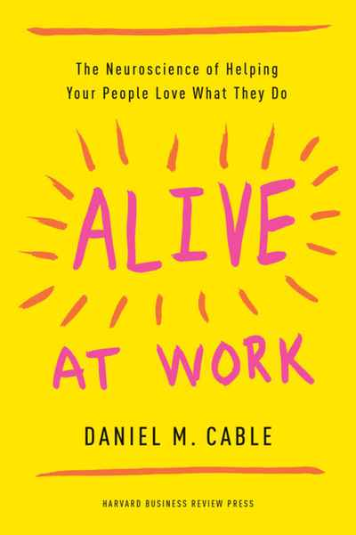
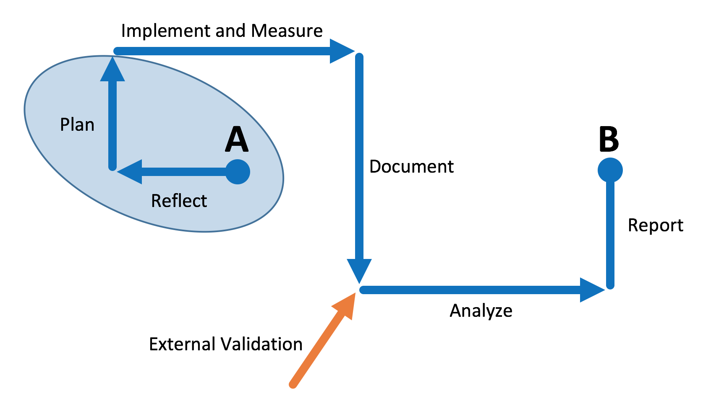

```{r setup, include=FALSE}
knitr::opts_chunk$set(echo = FALSE, fig.align = "center")
```
## Presentation Handouts
A few ancillary resources for the presentation are available online. Below are html links to the PDF documents. 

* <a href="http://www.reproducibleassessment.com/IUPUI2018/handout.pdf", target="_blank">QR codes and website information</a>
* <a href="http://www.reproducibleassessment.com/IUPUI2018/resources.pdf", target="_blank">PDF copy of a resource list</a>

## Objectives  
1. Recognize the components of interactive assessment reports as constructed at Ferris;
1. Locate and use the online tools necessary to create interactive assessment reports;
1. Appreciate the costs and benefits of interactive assessment reports;
1. Be prepared to use these employ these reports on their own campuses.


## About Ferris State
<div id="left">
* West Central Michigan  
* Medium Masters University  
* 13,800 students  
* Recently Revised General Education 
</div>
<div id="right">
<section class = "plain">
 
</section>


## Assessment in 1985
* First National Conference on Assessment in Higher Education
* Recommended that higher student achievement could be produced by:

	  1. Establishing high expectations for students  
	  2. Involving them in active learning environments   
	  3. Providing prompt and useful feedback   

## Computers in 1985
<div id="left">
* Apple 128K
* 128KB RAM
* No hard drive
* 1 3.5" 400KB floppy drive
* Must eject operating system to use another disk
</div>
<div id="right">
<section class = "plain">
 
</section>

## Portable Phones in 1985
<div id="left">
* Nokia TalkMan
* First "mobile" phone
* 11 pounds
* Carried in a large bag
</div>
<div id="right">
<section class = "plain">
 
</section>


## Engagement
<div id="left">
* 
* 
</div>
<div id="right">
<section class = "plain">
 
</section>

## The Assessment Cycle
<div id="left">
* Expensive planning and preparation
* Laborious pursuit of the prize
* Brief denouement
* Archive for posterity
</div>
<div id="right">
<section class = "plain">
 
</section>

## A Better Model
<blockquote>"Assessment is not a spreadsheet -- it is a conversation"<br />Irmeli Halinen</blockquote>
<section class = "plain">

</section>

## Reproducible assessment
<blockquote>Our goal is to create reproducible processes to increase transparency and <em>encourage faculty engagement</em>.</blockquote>  

* **ALL** assessment resources are public-facing  <br />  

	* Data reports (PDF and HTML)
	* Data analysis code (R)
	* Deidentified data files (csv)<br />

* All released with MIT or CC-BY licenses  
* All results are computationally reproducible and extensible

## An Example of Indirect Assessment
* Graduate Survey Results  
* Sent to all graduating seniors  
* Both quantitative and qualitative data  

* [http://www.reproducibleassessment.com/1703/](http://www.reproducibleassessment.com/1703/){target="_blank"}

## Authoring Tools [FREE] 
* [R](https://www.r-project.org)
* [RStudio](https://www.rstudio.com) - an IDE
* [Bookdown](https://cran.r-project.org/web/packages/bookdown/bookdown.pdf) - A RStudio package
* [git](https://git-scm.com) - version control
* [LaTeX](http://xetex.sourceforge.net) (XeTeX) - for PDFs

## Publishing Tools [FREE]
* [GitHub](https://github.com) - online version control
* [Open Science Framework](https://osf.io) - free data sharing
* [Disqus](https://disqus.com)
* The sky is the limit on the cloud

## Training Resources [FREE]
* [RStudio Tutorials](https://www.rstudio.com/online-learning/)
* [Bookdown Book](https://bookdown.org/yihui/bookdown/)
* [R for Data Science Book](http://r4ds.had.co.nz)
* [Git Book](https://git-scm.com/book/en/v2)
* [Reproducible Research with R and RStudio Book](https://englianhu.files.wordpress.com/2016/01/reproducible-research-with-r-and-studio-2nd-edition.pdf)
* [R Markdown: The Definitive Guide Book](https://bookdown.org/yihui/rmarkdown/)

## Standardize: Measures
* Created in order to get more uniform data collection and summarization

>* 14 different type of measures are defined  
>* Instructors can choose to use any one they wish <br /><br />  

>1. Exams
>2. Products
>3. Performances

## Standardize: Registering Courses
* I need to know who is doing what each semester

>* Who is collecting data?
>* What competency is being measured?
>* What outcome is being measured?
>* What measure is being used?
>* All tracked using a Google form

## Standarize: Data Collection
* <a href="https://ferris.edu/HTMLS/academics/general-education/procedures/forms/workbooks/index.htm", target="_blank">This is the biggest step forward for us</a>

>* Excel workbooks to collect and summarize student results
>* SCORE, PREPOST, NORM, RUBRIC
>* Common metadata supplied by instructors
>* Enter student names, IDs, and appropriate evaluations
>* A standaridized summary is automatically generated

## Standardize: TracDat Assignments
* Seeking to minimize the need for faculty to log into TracDat

>* Received as an email
>* Copy and paste summary
>* Select a few responses from drop-down menus
>* Add a short reflection
>* Attach the workbook and submit

## Automate: Analysis of Student Data
* All workbooks are stored in the TracDat document repository

>* Each semester's data is in a separate folder
>* Download all the workbooks
>* An R script is used to process the workbooks
>* All data is aggregated into one csv file
>* Identifiable information is removed

## Automate: Reporting

>* Using R and bookdown (Rmarkdown)  
>* Reuseable, version-controlled code  
>* PDF reports for printing  
>* HTML reports for distribution and collaboration  

## Assessment in Action
* **Five means of creating a dialog:** <br /><br />  

>1. <a href="http://www.reproducibleassessment.com/1601/report-1601.pdf", target="_blank">Print reports for dissemination</a>  
>2. <a href="http://www.reproducibleassessment.com/1601/", target="_blank">Online forums for extended discussions</a>  
>3. <a href="https://doi.org/10.17605/OSF.IO/35GSR", target="_blank">OSF projects as the ultimate home base</a>  
>4. <a href="http://github.com/weebeasties/1601_SCI1", target="_blank">GitHub repositories for reproducibility</a>  
>5. <a href="https://weebeasties.shinyapps.io/Dashboard", target="_blank">Executive dashboard for overviews</a>  

## Summary

>* We are creating a _collaborative_ assessment environment  
>* This is more about **process** than **personality**  
>* Focus is on making a **resource** rather than just **reports**    

## Questions?

* All of these resources are linked to from your handouts  
* Licensed using either CC-BY 4.0 or MIT  
* Feel free to contact me if you have questions or comments  

<section class = "plain">
 
</section>
